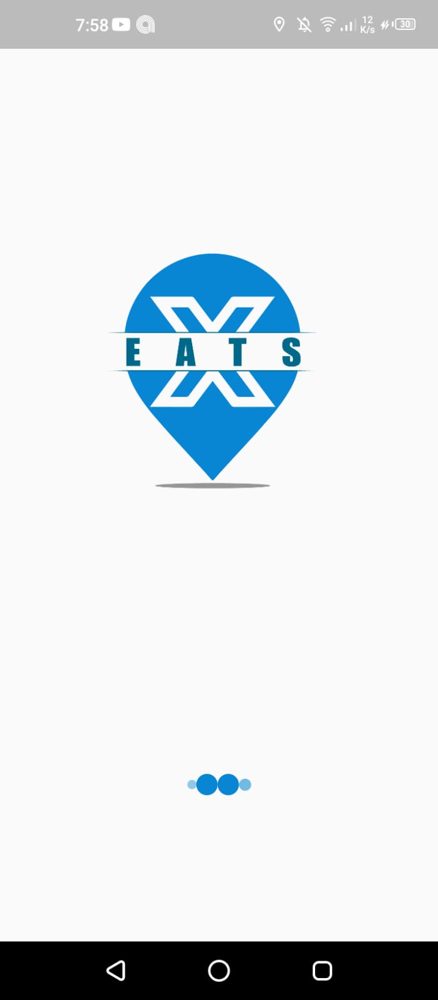
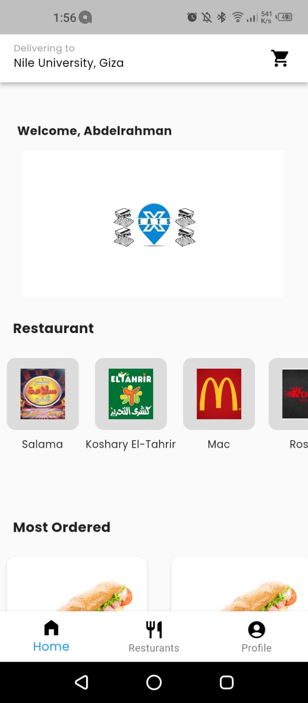
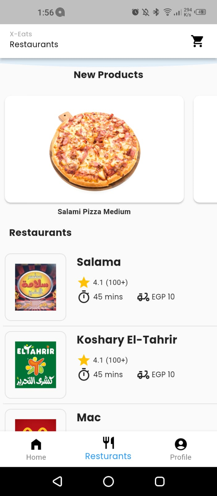
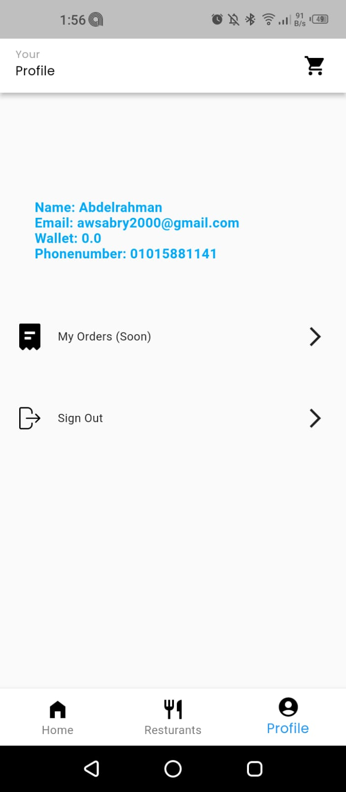
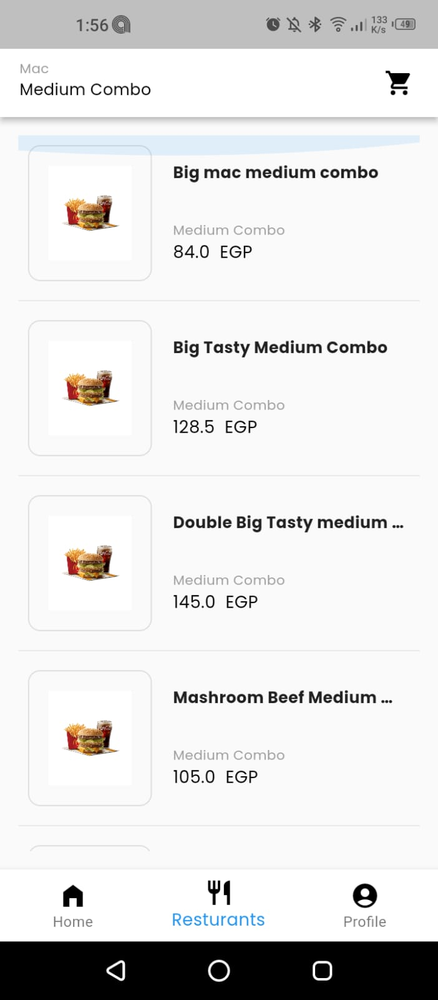
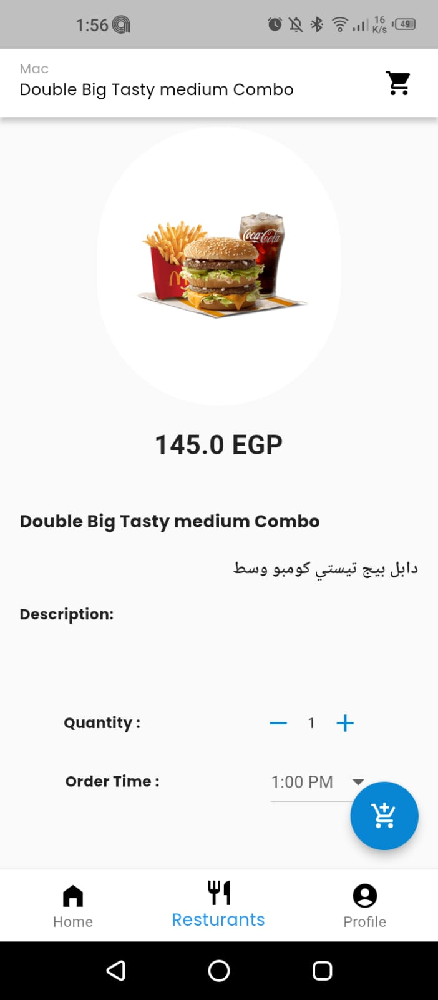
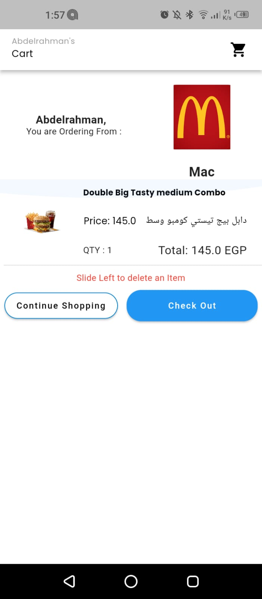
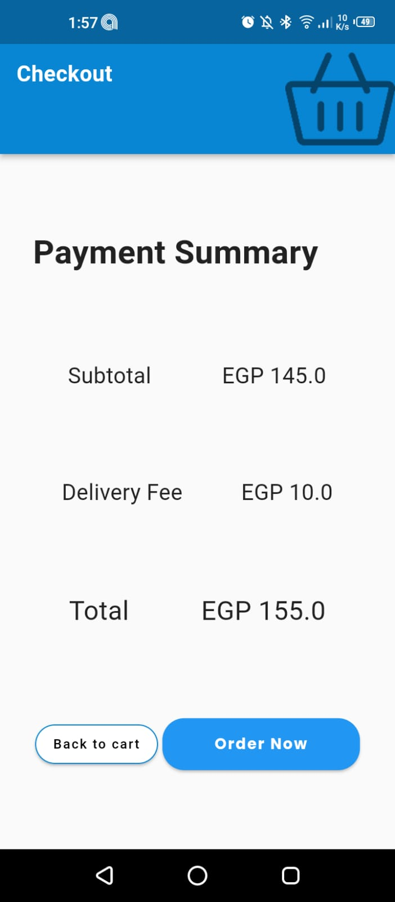

# X-Eats

    <h3> Eat More, Pay Less </h3>
    

    
## Platform for Food Distribution service.

## Brief OverView

X-Eats is NU students project was established in 2019, but the idea was founded by Abdelrahman Wael in Jan 2018, since that Nile University is located on a way with no source of food exist there, only delivery is used to order the food & since he was a freshman student at his university he wasn’t have the cash & the ability to order daily, so he tried to solve the problem for him & his friends, so he found the idea of X-Eats, a platform that allow the people in same location be shorted in one delivery cost from the restaurant, then the project start running into business, in 2019 every order ordered from X-Eats was costing 5 L.E in the order, whatever the order items is, & we worked for a whole one year, shortage the data of only one semester from this.. The team was 3, Abdelrahman Wael , Hassan El-Shazly, Moataz-Bellah Ahmed.

## Technicalities

This project is a starting point for a Flutter application, the website is X-Eats : [https://www.x-eats.com](http://www.x-eats.com/)

## Screenshots

    
    
    
    
    
    
    
    

- Restaurant Error when doesn't logged in -- Done

- Order From Multiable Restaurant not added

- Image doesn't load coming from the cart & going to the product Details, Story :
When I add a product to the carrt, then click on the product to update the quantity, the product detail screen doesn't load the image -- Done

- The app bar when it returns back from the cart takes to much time to load

-Messages on mobile check by status code & get it from the backend message.

- When Deleting cartItem, it should auto navigate to home page if cart is empty

- if location is not containing restaurants, return a message in the center of the screen that x-eats will be operating to your location soon, not the same message "Please select your current location" 

Cancelling : -- done

Cancelling orders is not working due to the emitting bug

When I press cancel, the order is not cancelled, but it navigate to the home page and after even refreshing the order existence is not working to return me to the waiting room

Note : The order is not cancelled after the first request, but after refreshing, it returns me to the home page, after another refresh, it returns me to the waiting room then the order is cancelled successfully

- The Search from the endpoint

- Change the getRestaurantsOfLocation, location from the order cubit to the restaurant cubit

- What is the diff between the general & the global components

- Give Me Direct Loading after pressing order not in checkout

- Give me message when cancelled

